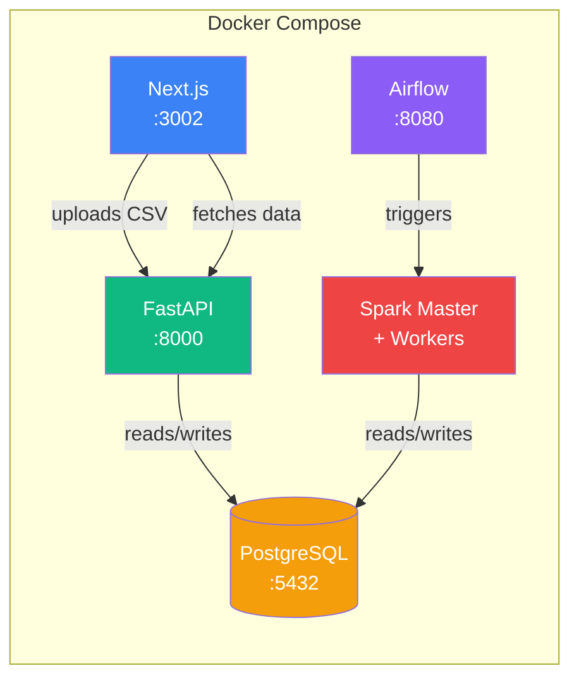

# Dubai Real Estate Market Intelligence Platform

> End-to-end data platform processing Dubai Land Department transactions, rent contracts, and property valuations.
> Docker Compose orchestrates the full stack. Upload CSVs, deduplicate automatically, query via API, visualize on an interactive map.

## Tech Stack

| Layer | Technology | Role |
|-------|-----------|------|
| Orchestration | Docker Compose | 7-service platform orchestration with health checks |
| Storage | PostgreSQL 16 | Raw data, analytics tables, quality checks, upload tracking |
| Ingestion | Python (pandas, psycopg2) | CSV auto-detection, null normalization, deduplication |
| API | FastAPI + async SQLAlchemy | 14 REST endpoints with auto-generated OpenAPI docs |
| Frontend | Next.js 15, React 19, shadcn/ui | Dashboard, data tables, upload interface, interactive map |
| Pipeline | Apache Airflow 2.x | DAG scheduling for Spark aggregation and quality checks |
| Processing | PySpark | Distributed cross-dataset aggregation |
| Visualization | deck.gl + MapLibre GL JS | GPU-accelerated heatmap, 3D hexagons, scatterplot |

## Architecture



## Data Sources

Three CSV datasets from [Dubai Land Department](https://dubailand.gov.ae/en/open-data/real-estate-data/) via [data.dubai](https://data.dubai):

| Dataset | Unique Key | Content |
|---------|-----------|---------|
| Transactions | `transaction_id` | Sales, mortgages, gifts with property details and amounts |
| Rent Contracts | `contract_id` + `line_number` | Ejari rental registrations with annual amounts |
| Valuations | `procedure_number` + `instance_date` | Property evaluations with assessed values |

All three datasets share `area_id` / `area_name_en` as a join key (119+ common areas).

## Quick Start

Prerequisites: Docker and Docker Compose.

```bash
git clone https://github.com/lfcruz2/dubai-real-estate-platform.git
cd dubai-real-estate-platform
cp .env.example .env
docker compose up -d
```

### Loading Data

1. Download CSVs from the [DLD open data portal](https://dubailand.gov.ae/en/open-data/real-estate-data/)
2. Place them in `raw_source/`
3. Run the ingestion:

```bash
make seed
```

Or upload files via the web interface at http://localhost:3002/upload.

The ingestion pipeline auto-detects the dataset type, normalizes null values, and deduplicates. Re-uploading the same file inserts 0 new rows.

## Features

### Dashboard
KPI cards, top areas, recent uploads, and data quality checks with tabbed Issues/Passing panel.

### Data Tables
Filterable, sortable, paginated tables for transactions, rents, and valuations. Collapsible filter panels expose all API query parameters.

### Area Intelligence
Browse 119+ areas with cross-dataset statistics. Click any area for a detailed summary spanning transactions, rents, and valuations.

### Interactive Map
Three visualization modes powered by deck.gl:
- **Circles** — Sized by volume, colored by transaction group
- **Heatmap** — GPU-accelerated density visualization
- **3D Hexagons** — Extruded hexagonal bins with height and color

Features: time slider, group/type filters, summary stats bar, click-to-detail panel.

### Data Ingestion
Drag-and-drop CSV upload with auto-detection, deduplication, and upload history tracking.

### Data Quality
Automated checks for row counts, null rates, value ranges, upload freshness, and cross-dataset area coverage. Results visible on the dashboard.

### Processing Pipeline
Airflow-orchestrated Spark jobs compute quarterly aggregations and rental yields across all three datasets.

## Services

| Service | URL |
|---------|-----|
| Frontend | http://localhost:3002 |
| API Docs (Swagger) | http://localhost:8000/docs |
| Airflow UI | http://localhost:8080 |
| Spark Master UI | http://localhost:8081 |

## Development

```bash
make up        # Start all services
make seed      # Ingest CSVs from raw_source/
make test      # Run API test suite
make down      # Stop all services
make logs      # Tail all service logs
make clean     # Stop everything and wipe volumes
```

## Documentation

Full documentation is available in the [Wiki](../../wiki):

- [Architecture](../../wiki/Architecture) — System design and data flow
- [Getting Started](../../wiki/Getting-Started) — Setup and first run
- [Data Model](../../wiki/Data-Model) — Database schema and tables
- [Data Ingestion](../../wiki/Data-Ingestion) — CSV upload and deduplication
- [API Reference](../../wiki/API-Reference) — All 14 endpoints with parameters
- [Frontend Guide](../../wiki/Frontend-Guide) — All 8 pages and components
- [Map Visualization](../../wiki/Map-Visualization) — deck.gl layers and interactions
- [Pipeline & Processing](../../wiki/Pipeline-and-Processing) — Airflow DAGs and Spark jobs
- [Data Quality](../../wiki/Data-Quality) — Quality checks and dashboard
- [Development](../../wiki/Development) — Commands, ports, project structure

## License

MIT
